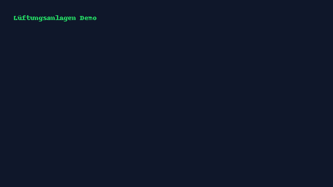

# Lüftungsanlagen – Grundlagen (Interaktive Schulungs-Web-App)

**Stack**: React + Vite + TypeScript, Tailwind, Zustand, MDX, Cypress, Vitest, PWA  
**Node**: 18 LTS (`.nvmrc`)

## Quickstart
```bash
npm i
npm run dev
```
Open http://localhost:5173

## Scripts
- `dev` – Vite Dev Server
- `build` – Production build
- `preview` – Preview static build
- `test` – Vitest (unit)
- `test:e2e` – Cypress run (headless)
- `lint` – ESLint
- `format` – Prettier

## Qualitätsziele
- Lighthouse: Performance ≥ 90, A11y ≥ 95, Best Practices ≥ 90
- WCAG 2.2 AA: Tastatur, Untertitel/Transkripte, Kontraste
- DSGVO: On-Device-Tracking (Standard), Consent, Löschkonzept

## Troubleshooting
- **Blank Screen**: Browser-Konsole prüfen; `npm run preview` testen.
- **STT/TTS**: Web Speech API benötigt HTTPS/localhost; Browser freigeben.
- **Service Worker**: Bei Dev mit `vite-plugin-pwa` ggf. Neu-Laden/Unregister.

## Demo

